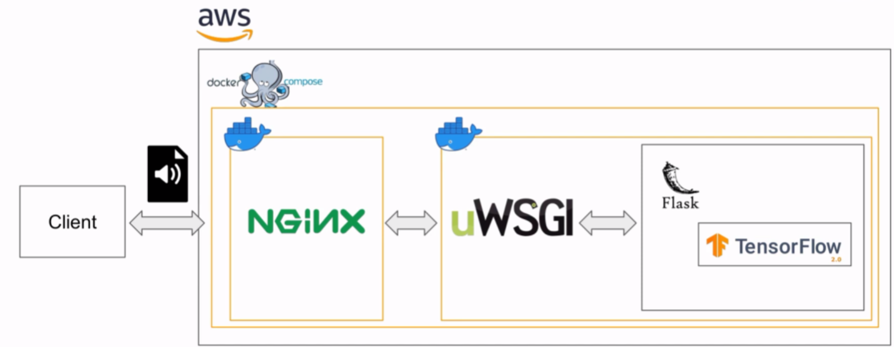
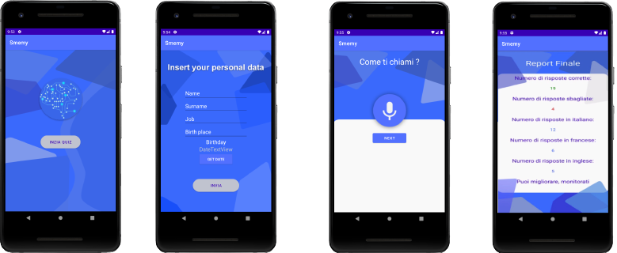

# IOT_AlzheimerApp

Multimedia App and Internet of Things final project

## Note

Per non consumare il massimo di richieste gratuite disponibili per il server AWS abbiamo eseguito la maggior parte dei test utilizzando una copia del server locale.
Per potersi connettere al server remoto è necessario modificare il codice all'interno del file app/src/main/java/com/example/profile/PgQt.java alla riga 143 e sostituire la variabile R.string.server_url_local con R.strings.server_url_remote

## Idea di progetto

Abbiamo realizzato un'applicazione per testare lo stato mnesico di un soggetto e quindi valutare la presenza di Alzheimer.
Abbiamo deciso quindi di estrapolare una parte di un test utilizzato per valutare lo stato mentale di un soggetto chiamato I.M.C.T, il quale permette di porre domande alle quali il paziente dovrà rispondere attraverso l'uso della voce.

L'applicazione riconoscerà attraverso dei modelli di Machine Learning le risposte e ritornerà se queste ultime sono corrette o meno e la lingua nella quale sono state pronunciate.

## Architettura

## Applicazione

## Altro

Per avere un quadro generale del progetto è disponibile una [Presentazione](Presentation\IOT_Project.pdf)